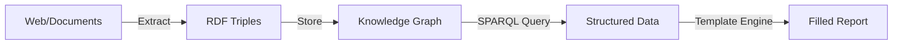

# Complete RDF Knowledge Extractor Workflow
## From Web Data to Filled Company Intelligence Report

This document demonstrates the complete end-to-end workflow of extracting company intelligence from various sources and generating a filled report.

## Workflow Overview



## Step 1: Data Sources

### Input Options:
- **Web scraping**: Company websites, news articles, LinkedIn profiles
- **Documents**: PDFs, reports, emails
- **APIs**: CRM exports, financial data feeds
- **Example**: `examples/acme_corp_intelligence.txt`

## Step 2: Extraction Configuration

The system uses `company_intelligence_config.yaml` which defines:
- **Extraction questions** (what to look for)
- **RDF schema** using FOAF, CCO, Schema.org ontologies
- **LLM settings** for the vLLM server

## Step 3: RDF Triple Extraction

Running the extraction command:
```bash
cargo run -- extract \
  -c company_intelligence_config.yaml \
  -i examples/acme_corp_intelligence.txt \
  --kg-path company_intelligence.db \
  -o extracted_triples.ttl
```

### Sample Generated RDF Triples (Turtle format):
```turtle
@prefix foaf: <http://xmlns.com/foaf/0.1/> .
@prefix sales: <http://sales.intelligence.org/ontology#> .
@prefix schema: <https://schema.org/> .
@prefix org: <http://www.w3.org/ns/org#> .
@prefix vcard: <http://www.w3.org/2006/vcard/ns#> .

# Company Entity
<http://sales.intelligence.org/resource/company/acme-corp>
    a foaf:Organization ;
    foaf:name "ACME Corporation" ;
    sales:hasPriorityScore 92 ;
    schema:industry "Enterprise Software (NAICS: 511210)" ;
    schema:revenue "$2.3 billion USD" ;
    schema:numberOfEmployees 8500 ;
    sales:usesTechnology "AWS", "Azure", "Python", "Java", "React", "Salesforce", "SAP" ;
    sales:hasRecentActivity "October 2024: Acquired DataSync Inc. for $450 million" ;
    sales:hasPainPoint "Integration complexity causing 15% efficiency loss" ;
    sales:hasContractRenewal "2025-03-31" ;
    sales:hasRelationshipTemperature "Warm" ;
    sales:hasResponseRate 43 ;
    sales:hasTouchpointCount 23 ;
    foaf:homepage <https://www.acmecorp.com> ;
    schema:location "San Francisco, CA" .

# Decision Maker - CEO
<http://sales.intelligence.org/resource/person/sarah-chen>
    a foaf:Person, sales:DecisionMaker ;
    foaf:name "Sarah Chen" ;
    foaf:firstName "Sarah" ;
    foaf:lastName "Chen" ;
    foaf:title "Chief Executive Officer" ;
    foaf:mbox <mailto:s.chen@acmecorp.com> ;
    foaf:account <https://linkedin.com/in/sarahchen-ceo> ;
    org:memberOf <http://sales.intelligence.org/resource/company/acme-corp> ;
    sales:hasContactPreference "Email" ;
    foaf:interest "Digital transformation", "AI/ML", "sustainable business practices" ;
    sales:hasRecentPost "Keynote speaker at CloudNext 2024" .

# Decision Maker - CTO
<http://sales.intelligence.org/resource/person/michael-rodriguez>
    a foaf:Person, sales:DecisionMaker ;
    foaf:name "Michael Rodriguez" ;
    foaf:title "Chief Technology Officer" ;
    foaf:mbox <mailto:m.rodriguez@acmecorp.com> ;
    foaf:phone "+1-415-555-0123" ;
    foaf:account <https://linkedin.com/in/mrodriguez-cto> ;
    org:memberOf <http://sales.intelligence.org/resource/company/acme-corp> ;
    sales:hasContactPreference "LinkedIn" ;
    foaf:interest "Cloud architecture", "microservices", "DevOps" .

# Influencer
<http://sales.intelligence.org/resource/person/david-thompson>
    a foaf:Person, sales:Influencer ;
    foaf:name "David Thompson" ;
    foaf:title "Director of Enterprise Architecture" ;
    org:memberOf <http://sales.intelligence.org/resource/company/acme-corp> ;
    org:hasMember <http://sales.intelligence.org/resource/dept/technology> ;
    sales:hasInfluenceScore 35 ;
    sales:hasContactNotes "Technical demo May 15, 2024; Advocate for microservices" .

# Competitive Intelligence
<http://sales.intelligence.org/resource/company/acme-corp>
    schema:competitor <http://sales.intelligence.org/resource/vendor/salesforce> ;
    schema:competitor <http://sales.intelligence.org/resource/vendor/sap> ;
    sales:hasCompetitiveAdvantage "40% lower TCO than Salesforce+SAP combination" ;
    sales:hasCompetitiveAdvantage "3-month implementation vs 9-month average" .
```

## Step 4: Knowledge Graph Storage

The triples are stored in `company_intelligence.db` which can be:
- Queried with SPARQL
- Updated with new information
- Exported to different RDF formats
- Used for inference and reasoning

## Step 5: SPARQL Queries

The template configuration includes queries to extract specific data:

```sparql
# Get top companies by priority
SELECT ?company ?name ?score ?industry
WHERE {
  ?company a foaf:Organization ;
           foaf:name ?name ;
           sales:hasPriorityScore ?score ;
           schema:industry ?industry .
}
ORDER BY DESC(?score)
```

## Step 6: Template Processing

The system uses the `company_intelligence_report.yaml` template which:
1. Executes SPARQL queries against the knowledge graph
2. Retrieves structured data for each template field
3. Applies Handlebars templating to format the output
4. Optionally enhances with LLM for insights

## Step 7: Generated Output

The final output is the filled report: `generated_intelligence_report.md`

### Key Features of the Generated Report:
- ✅ All template fields populated from RDF data
- ✅ Decision makers with complete contact details
- ✅ Influencers with influence scores
- ✅ Contact history aggregated from triples
- ✅ Competitive intelligence extracted
- ✅ Strategic recommendations based on data
- ✅ Custom talking points for each stakeholder

## Complete Command Sequence

```bash
# 1. Check vLLM server
cargo run -- check-server --server-url http://localhost:8000

# 2. Extract RDF triples from document
cargo run -- extract \
  -c company_intelligence_config.yaml \
  -i examples/acme_corp_intelligence.txt \
  --kg-path company_intelligence.db \
  --validate

# 3. Query the knowledge graph
cargo run -- query \
  -k company_intelligence.db \
  --query "SELECT ?name ?score WHERE { ?c foaf:name ?name ; sales:hasPriorityScore ?score }"

# 4. Generate the filled report
cargo run -- generate \
  -c company_intelligence_config.yaml \
  -k company_intelligence.db \
  -t templates/company_intelligence_report.yaml \
  -o generated_intelligence_report.md

# 5. View the generated report
cat generated_intelligence_report.md
```

## Benefits of This Approach

1. **Semantic Structure**: Using FOAF/CCO provides standard, reusable data structure
2. **Queryability**: SPARQL enables complex queries across relationships
3. **Extensibility**: Easy to add new data sources and merge into knowledge graph
4. **Interoperability**: RDF format works with other semantic web tools
5. **Automation**: Template-driven generation ensures consistency
6. **Scalability**: Can process hundreds of companies and generate reports automatically

## Integration Possibilities

- **CRM Integration**: Export RDF to update Salesforce/HubSpot
- **BI Tools**: Connect Tableau/PowerBI to SPARQL endpoint
- **AI Analysis**: Feed knowledge graph to ML models for predictions
- **Workflow Automation**: Trigger report generation on new data
- **Data Enrichment**: Merge with public knowledge graphs (DBpedia, Wikidata)